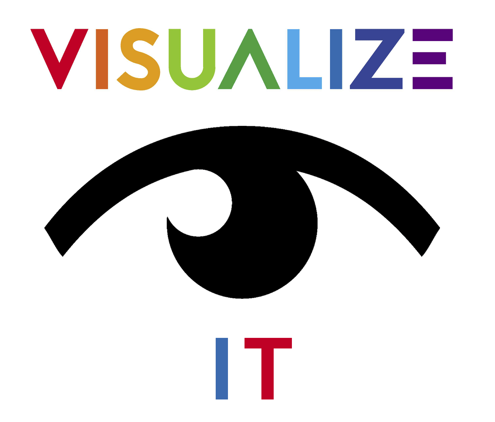

# visualize-it

<ul>
  
  <i>... your view into <b>External Systems!</b></i>
</ul>


# At a Glance

- [Overview]
- [Tool Manifestation]
  - [Visualizations]
  - [Component Libraries]
- [Sample Code]
- [Data Model]
- [Communications Protocol]
- [View]
- [Components]
- [Perspectives]
- [Logic]
- [Internals]
  - [Tab Manager]
  - [Component Catalog]
  - [Systems Resources]
  - [Class Abstractions]
- [Action Items]


<!--- *** SECTION *************************************************************** --->
# Overview

**visualize-it** promotes an interactive graphical visualization of an external system!

<p align="center">
  
</p>

What, _you might be asking_, is a system?  A system can be virtually
anything!  Ultimately it is whatever is on the other end of a
**[Communications Protocol]**, conveying changes to a domain-specific
**[Data Model]**.  As an example, a system could be:

- an actual **physical system** _(e.g. a Power Plant, a Distillation Unit, a CNC Machine, etc.)_
- a **microcontroller** (MCU/EMCU)
- a **playback recording** of a physical system _(for analysis)_
- an **Internet of Things** (**IoT**) house monitor
- a **dashboard** monitoring a system
- a **simulation**
- a **schematic** ... electrical, or mechanical _(driving a simulation)_
- a **game**
- etc.

**visualize-it** has the following characteristics:

1. it is manifest through an **interactive view**, that contains **graphical
   components** that are recognizable as part of the system, for example:

   - pumps and valves and pipes
   - gauges and monitors
   - an **IoT** house monitor
   - an interactive game with various player pieces
   - etc.

1. it is backed by a **[Data Model]** that will change over time
   through a **[Communications Protocol]**
   
1. it can be **animated** over time, for example:
   
   - visualizing the flow and pressure of a distillation unit
   - showing a pump as open or closed
   - showing house lights as on/off
   - showing the current position of a game's player piece 
   - etc.
   
1. it can be **interactive** in the sense that it is capable of controlling
   various aspects of the system _(part of the communication
   protocol)_, for example:
   
   - a valve could be opened or closed through an interactive component
   - a game piece could be moved
   - etc.

1. **multiple concurrent views** are supported, for example:

   - showing different functional aspects of the same system
   - etc.


<!--- *** SECTION *************************************************************** --->
# Tool Manifestation

**visualize-it** is a tool that allows you to define visualizations
that are packaged for use by other external applications.  In that
sense it is:

- a **Builder** of visualizations _(i.e. a tool)_
- a **Bundler** of visualizations _(promoted to other external applications)_

This combines the:

- the model definition

- the communication protocol interacting to the external system,
  allowing the model to change over time

- the views that contain the visual components that are bound to the underlying data model


The tool allows you to maintain BOTH system-specific
**Visualizations** and **Component Libraries**.


**KEY AI PERSIST**: _Persistence vs. Executable Parcel Bundles_
<ul> <!-- cheap indentation -->

I am starting to refine the concept of persistance:

- The **system visualizations** are "persisted" resources, loaded at run-time
- The **core visualize-it** lib -AND- **plugin component** libs are executable parcel bundles


<br/>If true, this means that external apps:

- must include npm packages for:
  - **core visualize-it**
  - and **plugin component**
- and must load **system visualizations** through some I/O mechanism

</ul>


<!--- *** SUB-SECTION *************************************************************** --->
## Visualizations

A **Visualization** is a run-time bundle of views and perspectives
used by external applications to visualize a system ... animated
through data model changes driven by a well defined communication
protocol.

The primary function of the **visualize-it** tool is the interactive
definition and packaging of these system-specific **Visualization**
resources.

A **Visualization Bundle**:

- contains:
  * **views**:        a component display-list of a functional view
  * **perspectives**: organized views in a pre-defined layout

- is maintained interactively by the tool

- is a run-time resource that is stored externally:
  * AI: for desktop app, a file-based resource
  * AI: for web app, either cloud-based (say firebase), or file-based (through simulated means - download/upload)

- is the entry point for package bundling
  * AI: PERSIST: I think this is more about persistence of these bundles, rather than an executable parcel bundle!
  * AI: PROB NOT: programmatic parcel invocation
    - PROBLEM: appears to be file-based ... i.e. could not invoke from a JS structure
    - may be able to define our own parcel Asset object derivation, parsing to an AST (whatever that is)
    - WORK-AROUND: make it a development script
      * STILL don't know how to seed an entry file
        - we have a run-time structure
        - POSSIBLY from the saved run-time resource (as a desktop app above)
        - WORK-AROUND: log to console and save manually


Here is the **Visualization** structure:

```
  system         ... visualization of a given system -OR- visual(s) <-- bundle entry point (PERSIST)
   │
   ├── name      ... system name
   ├── desc
   │
   ├── metaModel ... NOT:  The real-time data model and communication is supplied separately (at run-time).
   │                       We should have enough metaModel data within the component bundle
   │                 PROB: Each comp needs some type of "delayed binding" to the real-time data model
   │                       ... possibly through a model node id?
   │                 ALT:  Could we have a copy of all the nodes/type in the real-time data model
   │                       ... seems rather brittle
   │
   ├── SmartView(s)   ... a "view" ... a component display-list of a functional view
   │    │
   │    └── SmartComp(s)
   │
   └── Perspective(s) ... organized views in pre-defined layouts
```


**AI**: _Flesh out more ... may be obsolete_
```
                        Definition:  Visualization:
                        Schematic    Visualize
                        Capture      with Animation and Controls
                        =========    =========
  > Builder
  - Electron Desktop       YES          YES
  - Web App              POSSIBLE       YES    ... AI: unsure if this is feasible
                                                       (with file/save and webpack usage, etc.)


  > Bundler
  - Library              POSSIBLE       YES    ... supports visualizations in ANY app
```

**AI**: Sidebar: _packaging an Electron App_
- sounds like there are two 3rd-party options
  - electron-packager
  - electron-builder

**AI**: _may be able to bundle the run-time using "dynamic import" (i.e. import())_
```
- Evaluating JavaScript code via import()
  ... https://2ality.com/2019/10/eval-via-import.html
  >>> KJB: This is discussing how to inject JavaScript from a dynamic string using dynamic import (i.e. import())
  >>> KJB: I wonder if this could be used to bundle my stuff?
           Warning: This code only works in web browsers. 
                    Because in Node.js, import() does not support data URIs.
                    KJB: I still think I am OK as I should be dynamically importing 
                         a file-based bundle of code in my bundling process.
- must somehow define a standard interface to a module
  * and that module is dynamically gathered from somewhere
```

**AI**: _flesh out bundler and packaging_
```
- I think we are dealing with two distinct things:
  * meta information (possibly saved separate from run-time data)
    >>> KEY: we may be able to PROMOTE a run-time plugin architecture
             - using dynamic imports
             - and actually promote a set of domain-specific plugins
               ... in essence nothing out-of-the-box
  * run-time data model
```


<!--- *** SUB-SECTION *************************************************************** --->
## Component Libraries

Creating and maintaining "**Component Libraries**" is a development
task, requiring technical coding skills.  Because **visualize-it**
components are object-oriented classes _(derivations of SmartComp)_,
maintaining them requires JavaScript expertise.

As a result, these **Component Libraries** are part of a _**pseudo
plugin architecture**_. Components:

  - can be pulled in at run-time from external projects [**AI**:
    Dynamic Import (i.e. import())] _(if you are merely running the
    **visualize-it** app)_,
  
  - or can live within your **visualize-it** project _(if you have created a
    development work-space)_.


**Component Verification**

<ul> <!-- cheap indentation -->

<!-- AI: other terms:
verification
affirmation
confirmation
corroboration
validation
certification
-->

As part of the effort of coding and implementing individual
JavaScript components, the **visualize-it** app provides a number
of interactive tools to validate these components.

In essence this is running the component through all it's paces 
(visualization, transformation, animation, etc.).

**AI**: don't think any transformation is persisted ... this must be
reflected in the code.

**AI**: can this somehow drive a more formal unit test?

</ul>


**Project Structure**

<ul> <!-- cheap indentation -->

As a result, our project structure contains some aspects of a
**pseudo plugin architecture** (**AI**: may want to merely
reference `compLib/` dir of master source):

```
src/

  features/   ... provides interactive tool features (i.e. the React App)
                  NOTE: this is NOT packaged within our bundles
    etc...

  core/          ... core visualize-it run-time modules
                     NOTE: is packaged within our bundles
    SmartView.js ... visualize-it view
    SmartComp.js ... base class of all visualize-it components
    etc...

  compLib/ ... container of domain-specific component libs (multiple)
               NOTE: Component development is a technical coding task
                     AS A RESULT, this is a pseudo plugin architecture
                     AND is ALSO included in our bundles (i.e. packaged within our bundles)
                     AND can be one of two bundler entry point (the other is our visuals)
                         ... AI: would NOT want core modules resolved here
                                 UNSURE how this would be handled
                     AI: consider technique by which we could pull-in at run-time
                         ... say through "dynamic import" (i.e. import())
                         ... if so, this would somehow be another sub-bundle (of component libs)

    index.js ... combines (i.e. merges) ALL component domains into ONE catalog

    plumbing/        ... 'plumbing' components domain
      package.json   <<< UNSURE about mono-repos, but this may be required
      index.js       ... promotes compCatalog (see: Sample Code)
      SingleValve.js
      TwoWayValve.js

    electrical/      ... 'electrical' components domain
      etc...
```

Here is an example of a domain-specific entry point (promoted by `index.js`):

```js
export default { // example plumbing/index.js ... plumbing root (AI: needs to be named: 'plumbing')
  valves: [      // array indicates concrete class references
    SingleValve,
    TwoWayValve,
  ],
  pumps: [
    PowerPump,
    SumpPump,
  ],
}

/** NOTE: Each component class (above) contains the following props:

          - compName:         needed outside of object, for things like menu visual, and ?other

          - compIcon:         AI: an svg may be needed for easier menu representation

          - compBinding2Meta: this is ALSO code (must support multiples) 
                              and would be hard to do any other way

          - metaModel:        AI: I think this is elsewhere 
                                  (because one metaModel can be used by multiple components)
**/
```

</ul>


<!--- *** SECTION *************************************************************** --->
# Sample Code

The following **Sample Code** is used in subsequent sections to build
**visualize-it** concepts.

<a href="CodeRef.js" target="_blank">CodeRef.js</a> *(visualized in separate tab)*


<!--- *** SECTION *************************************************************** --->
# Data Model

The characteristics of a system is ultimately defined through a
domain-specific **Data Model**.  Information in this model spans a
wide range of possibilities, such as monitored values of interest in
our visualization, or performance characteristics of a simulation,
etc.

The Data Model may be defined in the client or the system or both.

Ultimately this model is defined through a handshake communication
protocol between the client and system, which allows it's values to
change over time.

AI: My current thoughts are that due to the "openness" of both the protocol and data
- We may want to simply leave the Data Model UP to the developer ... and keep it VERY OPEN!
- PRO: they can do whatever they want
- CON: it may be more difficult to provide interactive forms from which this data is maintained
       ... although it could be some callback
  ?? DUPLICATE THIS NOTE IN COM SECTION (below)


**SYNC POINT** ????????????????????????????????????????????????????????????

?? divide up into Meta Model and Model
   - the model is an instance (or data content) of a meta model
   - the model is what is communicated over-the-wire


AI: more-info on communication protocol
- is this completely open and defined by each app
- or is there some standards and guidance through some utility?


**Data**
AI: flesh out more detail

```
Data (?Meta):
- TYPED
- Initial: passed ONCE (to client or system) for initialization
           ... say for
               - simulation driver
               - or game initialization
           ... things like
               - performance data (simulation)
               - connectivity (schematic)
- Reoccurring: passed on each iteration cycle
              ... changing data iteratively

- NOTES:
  * Data MUST BE Typed
  * Initial/Reoccurring
    - distinction may be strictly communication protocol
    - may pass BOTH on initial handshake

- EXAMPLE (very early):

  meta-data: {
    ?? I THINK WE ARE GOING TO HAVE TO INVOLVE A SCHEMA
    ... say: https://json-schema.org/
             https://jsonschema.net/
  }

  run-time-model: {
    pres1: 123,
    pres2: 456,
  }

```


??? INTEGRATE FOLLOWING

```
  * vModel   ... meta data of the data model being represented
                 - catalog of all nodes (by name) and business data they represent
                 - this is the master source of the underlying system being modeled
                 - node connectivity is optional
                   ... depending on if the model is driving the service in this regard (say a simulation)
                   ... may not be necessary, if we are simply showing monitored components of a real system
                   ... how is connectivity modeled (a graph or something else)
                 - ? AI: is it possible this model is manifest/maintained in a graphical way
                   ... through some generic nodal representation?
                 - ? AI: HOW IS THE MODEL DATA ASSOCIATED TO THE VISUAL COMPONENT
                   - ? some of this data is manifest visually
                     * in our diagram components
                     * and in our animation
                   - ? it seems that the component must somehow constrain the data it is modeling
                     ... is it possible to define some "well-known" component name
                         - that is a required link to specific component types
                           ... latching onto their data
                         - even defining attributes that are alias to self's data content
                   - ? however other times, it may be more open and dynamic
                     ... ex: a monitored component could technically latch on to any property?

- ??$$ we need to integrate an "OM: Object Model" (our OWN) to the "GM: Graphic Model" (the chosen tool)

- the OM contains:
  * various business parameters (as needed)
  * an intelligence of what various GM artifacts are
    ... ex: a "connector"

- ? the integration of these two models MUST BE bi-directional
  ... ex: the OM knows how to re-render the GM
  ... ex: given a GM artifact, can access OM

- ? both models must be serializable as a unit
  ... to save/retrieve

```


??? INTEGRATE Generic Forms for JSON
```
- ? Can a generic form maintain a json structure?
  * this is a react json forms tool, but I think it is using json as it's form schema
    ... https://jsonforms.io/
- ? is this needed in the Builder or Reveal-Bundler or both

```


<!--- *** SECTION *************************************************************** --->
# Communications Protocol

??

- ?? the protocol to interact with the SYSTEM ( ?service/server/backend/driver/externalFeed)
  (i.e. what is being visualized)

- ?? a "playback" mode indicates that there is NO "interactiveness" within the visualization


- ?? haven't addressed initial handshake and where data is mastered initially (client/system)


<!--- *** SECTION *************************************************************** --->
# View

??

?? a collection of visual components illustrating a model (all or part) <<< ?? RENAME to vView
- kinda the display view canvas
- can be many things

```
??
- Our system supports multiple views of our model

* Each view is basically a viewport (a Display List) 
  containing components (logically tied to the master data model)
  - the component position/layout is specific to each view
  - Each component is a visual representation of a single Data Node (in our master model)
    * Each component has a mapping to reference the underlying single Data Node
  - Each view is NOT required to visualize the entire model
    ... this allows us to focus some "functional" subset of interest
    * We may decide to support a "Master" view, that is required to have ALL nodes in the model
      ... this would provide us with the technique to setup our overall complete model

* These views are visualized in separate partitions
  - this may be in the same browser window
    * a roll-my own so-to speak
    * PRO: better for tablet device (where multiple browser windows may NOT be possible)

  - ?? Quest: can we optionally support multiple browser windows?
    * REFS:
      - Can I control two browser windows with one HTML5 app?
        ... https://stackoverflow.com/questions/5277482/can-i-control-two-browser-windows-with-one-html5-app
      - ?? google: window.open() can JavaScript share data/code between two browser windows

      - How to Communicate Between Parent and Child Windows in Javascript
        ... http://usefulangle.com/post/4/javascript-communication-parent-child-window
        ??? GOOD REFERENCE WITH EXAMPLES

    * KJB: I think in using window.open(), I may be able to share data between two windows
           - ? article talks about parent/child windows in conjunction with window.open()
           - ? DATA SHARING: the article talks about invoking functions across windows in same domain
                             I wonder if you can simply "share" data objects too?
           - ? can I disable tabs
           - ? can I manage position and size
           - ? can I share JavaScript data and code (functions)
           - ? can I close a managed window? (say in loading a new)
           - ? it would really have to load a React App
             ... unless our view is STRICTLY our Display Port
    * KJB: Also consider <frame> and <iframe>
      ... unsure which is more supported, research compatibility, etc.
```


<!--- *** SECTION *************************************************************** --->
# Components

??

?? UI components making up a visual diagram
- supports connectivity to other components (in say a graph)
- supports animation with changes to data
- supports interactivity (set directives to model)


<!--- *** SECTION *************************************************************** --->
# Perspectives

??

```
??
- As a convenience, we will support "perspective" layouts (managing 1:M views in a perspective)
  ... where multiple views are pre-defined in our visual viewport
  ... keeping track of views, windows, zoom factor, and orientation
  ... this allows us to pull them up quickly
```


??


<!--- *** SECTION *************************************************************** --->
# Persistence ?? TOC

AI: how do we persist/reload ALL this?

AI: this section may be part of the Bundler discussion

```
??
- Everything MUST be "persistable"
  * Data Model
  * Views
    - Components
  * Perspectives
```


```
?? THIS MAY BE KEY IN BUNDLING
   - Builder: it is one thing to persist/reload within the Builder
   - Bundler: HOWEVER in the Bundler consideration IT ALSO INCLUDES CODE!
              ... I think this is the meta info (below)
              ... unsure how to bundle this code
              ... probably get into webpack/parcel/etc
              ... AND dynamically pull it in using dynamic imports!
   - Session: I think we will have a concept of a session file
     * that pulls all the run-time content together
     * CONSIDER: is it possible that with our code export (via webpack or whatever)
                 - that we would use THIS to persist BOTH our 
                   * component code
                   * and our session
                   * UNSURE
   - meta information (possibly saved separate from run-time data)
     * AI:  we may have an ability to combine MULTIPLE meta info ... in sort-of a run-time plugin technology!
     * N/A: metaModel     ... should NOT need this in a run-time environment
     * N/A: compCatalog   ... should NOT need this in a run-time environment AI: HOWEVER we do need some string xref to constructor functions
     * YES: bindComp2Node ... this is actually functions             ... would have to import as code
     * YES: Comps         ... this is actually constructor functions ... would have to import as code
   - run-time data model
     * model
     * comps        ... prob name only
     * views
     * viewPorts
     * perspectives
```


<!--- *** SECTION *************************************************************** --->
# Logic ?? TOC


AI: FUTURE - unsure if is needed (possibly for simulation -or- ACTUAL CONTROL of a system ... this could be scary

```
Models digital control logic through a visual logic diagram
- represented as a visual flow diagram
- supports programmatic setting of model
- KJB: I am trying to fully understand hos modeling logic fits in this overall product (may be a miss-match - not fully sure)
       * it IS applicable if we wish to simulate digital control logic that say drives a system
       * I suppose it may EVEN be applicable in production (say packaging logic to deploy to a system)
       * CERTAINLY, the term visualize-it could be extended to logic
         ... but this is DRIVING the external system
         ... NOT monitoring it ... hmmmm
- KJB: ?? Regarding modeling logic graphically (say to drive control logic, either in a simulation or possibly even for real)
  * ? Node-RED may fit the bill out-of-the-box
    ... https://nodered.org/
    ... https://nodered.org/blog/2019/09/30/version-1-0-released
    ... https://twitter.com/NodeRED
    * a graphical JavaScript language for programming event-driven apps
    * A visual tool for wiring the Internet of Things (IoT) ... mentioned in tweet
      ... KJB: unsure why it would be limited to IoT
      ... KJB: unsure if this would be part of visualize-it
```


<!--- *** SECTION *************************************************************** --->
# Internals

Internally, **visualize-it** contains a lot of dynamics:

- Tabs are used to dynamically display various resources (views,
  perspectives, components, etc.).

- In addition, these "dynamically displayed" resources are themselves
  dynamically obtained.  In other words they are retrieved at run-time
  and **NOT** statically known at compile time.

As a result of these dynamics, we document a number of characteristics
here.

**NOTE**: A key goal of this architecture is to maintain our
application state in a persistable form (i.e. serializable), so we can
easily retain UI characteristics between **visualize-it** sessions.
This would not be possible if we were to retain functions in our state
(as an example).


<!--- *** SUB-SECTION *************************************************************** --->
## Tab Manager

The **tabManager** feature is a dynamic manager of visual tabs.  

- Tabs are initially activated through **LeftNav** menu pallets.

- In turn, the displayed tab content is also dynamic in nature.

In support of these dynamics, the following structure is maintained.

**Tab Registry**

<ul>

The **tabManager** maintains a registry of all tabs that can be
visualized.

It is the responsibility of the various menus and controls to register
their tabs, before a "tab activation" request is made.  The reason for
this is related to our dynamics: the Tab Manger must have the ability
to instantiate tab content when it is first activated!

This Tab Registry contains the following information:

- `tabId` a globally unique key, identifying the tab in question.
  Typically a federated namespace is employed to insure this key is
  globally unique (ex: compLibName/comp, or systemName/view, etc.).

- `tabName` the name displayed in the tab.

- `tabCreator` a React Component that instantiates the tab content
  **without** any additional context _(in other words, it will be
  instantiated without any attributes)_.

**NOTE**: The `tabCreator` utilizes a React Component, rather than a
pre-instantiated element, because a component _(i.e. a function or a
class)_ is very light weight until it is instantiated.  This is
important because all tabs must be registered up front, just to
support their potential activation ... which may never occur,
depending on user activity.

A typical example of a `tabCreator` component that instantiates a
given SmartView, would be an anonymous functional component:

```js
const xyzView    = ... some SmartView
const tabCreator = () => <SmartViewReact view={xyzView}/>;
```

The important thing to note is that all context is provided via
closures and NOT through component parameters.

The **Tab Registry** has the following **API**:

```
+ registerTab(tabId, tabName, tabCreator): void
+ getTabName(tabId): tabName
+ getTabCreator(tabId): ReactComp ... that instantiates the tab content
                                      (or a "missing registration error" content)
```

</ul>


**Tab Actions**

<ul>

The following **Tab Actions** _(Action Creators)_ are available:

```
+ activateTab(tabId, preview=true): Action
    activate the specified tab (may exist, or will create on first reference)
    NOTES:
     1. the tabId is used to index into the Tab Registry
     2. preview (only used when referencing new [non-existent] tab)
          true:  preview tab   (single-click) <<< DEFAULT
          false: permanent tab (double-click)
     3. logic supplements this action with the following:
        action: {
          ... from incoming action:
          tabId:   'xyz'
          preview: true

          ... supplemented by logic:
          tabName: 'ValveXyz'  ... strictly a convenience
          pgmDirectives: {     ... simplifies reducer
            next_activeTabId:  'xyz' (or null when NO tabs)
            next_previewTabId: 'xyz' (or null when NO preview tab)
            removeTabId:       'abc' (or null) ... supports previewTab removal
            addNewTab:         true/false ... supports new tab creation (on first reference)
          }
        }

+ closeTab(tabId): Action
    close specified tab
    NOTES:
     1. logic supplements this action with the following:
        action: {
          ... from incoming action:
          tabId:   'xyz'

          ... supplemented by logic
          pgmDirectives: {     ... simplifies reducer
            next_activeTabId:  'abc' (or null when NO tabs)
          }
        }
```

</ul>

**Tab State**

<ul>

The following application **Tab State** is maintained:

```
tabManager: {
  activeTabId:  'xyz', // the tabId of the active tab
  previewTabId: 'xyz', // the tabId of the optional tab in preview mode (i.e. will be re-used)
  tabs: [                 // all active tabs
    {tabId: 'abc', tabName: 'WowZee'},
    {tabId: 'xyz', tabName: 'WowWoo'},
    ...
  ],
}
```
</ul>


<!--- *** SUB-SECTION *************************************************************** --->
## Component Catalog

?? I think this concept (currently ether) will be replaced with our libManager feature which has knowledge of all loaded libraries (SmartLib)

AI: Because SmartComp catalogs are dynamically retrieved at run-time,
they will have a similar registry process. This way we can support
persistance of our views (containing SmartComps), where the referenced
classes can be re-instantiated on retrieval.  The registry key would be
a federated classname (ex: myXyzLib-ValveXyz).

NOTE: I think this is true ... because the SmartView is a concrete
class, it can be implied in our persistance.  In other words there is
no registry for views.


<!--- *** SUB-SECTION *************************************************************** --->
## Systems Resources

see NOTE (above)


<!--- *** SUB-SECTION *************************************************************** --->
## visualize-it Object Model

### Class Hierarchy

```
   SmartModel .............. a top-level base class providing consistency in common attrs/APIs/utils/etc.
    │
    ├── SmartView .......... a viewport in which scene(s) are displayed/visualized
isA │
    ├── SmartScene ......... a graphical abstraction that visualizes a system (either in part or whole)
    │    ├── Scene ......... a visualization of a single Scene (a container of SmartComps)
    │    └── Collage ....... a visualization of multiple Scenes (a container of Scenes)
    │
    └── SmartComp        ... a graphical abstraction of a system component
         ├── DynamicComp ... a resource-based component - maintained by visualize-it's builder
         └── others      ... class-based components - developed in JavaScript code
```


### Object Mapping to Konva

```
Cardinality  KonvaJS           visualize-it
===========  ================  =============
             Stage (<div>)     SmartView     ... a viewport in which scene(s) are displayed/visualized
   1:M         Layer (Canvas)    SmartScene  ... a graphical perspective that visualizes a system (part or whole)
   1:M           Shape/Group       SmartComp ... a graphical representation of a system component
```


### Class Detail

```
SmartModel:  an abstract top-level base class providing consistency in
             name/id and defining common APIs/utils
             - id/name
             - various common APIs
               * AI: expand
             - various common utilities
               * AI: expand


SmartView:   a viewport in which scene(s) are displayed/visualized
             - Derivations of the contained SmartScene will handle the specifics
               of visualizing a single scene (Scene obj) or multiple scenes
               (Collage obj).
             - In all cases, this visualization can be "displayed":
               * in-line:  within the "contained" HTML DOM container
               * external: using external browser window(s)
               > NOTE: this MAY BE more of a run-time consideration
                       (rather than specified/retained in our editor)


SmartScene:  an abstract base class representing the graphical perspective
             that visualizes a system (either in part or whole).

  Scene:     a SmartScene derivation that models a single Scene to be displayed/visualized.

             A Scene represents a graphical perspective that visualizes a system
             (either in part or whole).
             - a scene contains visual components, arranged in a way that
               resembles a system
             - a scene can DIRECTLY mange it's x/y properties (this is used in
               the context of a Collage, where multiple scenes are offset within
               a viewport).
             - a scene DIRECTLY manges the width/height properties
             - different scenes may visualize various aspects of a system (for
               example a functional breakdown)
               * each scene INTERNALLY correlates to a separate Konva.Layer
             - FUTURE: support of user-defined functional layers:
               - scene may be further sub-divided into MULTIPLE functional layers
               - components of a scene will belong to one of these functional layers
                 ... Quest: is this a direct containment, or some logical tagging?
               - this allows the visualization of these functional layers to be toggled on/off
             - FUTURE: Animation Consideration:
               - internally each scene (and their functional layers) is
                 sub-divided into two Konva layers:
                 - a static layer
                 - an animation layer
                 > NEEDS WORK: may want to do things in our static layer (like change component color)

  Collage:   a SmartScene derivation in which multiple Scenes are displayed/visualized.


SmartComp:   an abstract graphical representation of a system component:
             - bound to a data model (for visual affects and animation)
             - their graphics are atomically managed (selection and transformation)
               ... using a single rooted Konva.Group
             - NOTE: SmartComp is abstract requiring derivation (for code-based compLibs)
                     HOWEVER: there is a concrete derivation that supports 
                              dynamic-based resource-loaded compLibs
                              (maintained by the visualize-it component editor)
           
                            SmartComp        ... abstract
                        isA  ├── DynamicComp ... a concrete derivation for dynamic-based resource-loaded compLibs
                             │                   ... managed by the visualize-it component editor
                             └── others      ... for code-based compLibs
```


### Animation Requirements

```
- may want to support an "animation" layer
  * HOWEVER, I really think the animation abstraction belongs in the component
    - consider this:
      * ALWAYS two layers within each scene - a static and an animation layer
      * AND our components are aware of these two layers
        ... in terms of where they "mount" their primitives
    - NEEDS WORK:
      * our animation may need to affect the characteristics in our static layer (such as component color)
        ... hmmmm
```


### Collage Requirements

AI: This discussion may be a bit misplaced

In support of our visualization requirement to be able to display ONE
or MORE scenes, we introduce a "Collage" concept, where multiple
scenes are managed.

As a result, we maintain the following SmartScene class hierarchy:

```
    SmartScene ......... an abstract base class representing the graphical perspective
     │                   that visualizes a system (either in part or whole)
isA  ├── Scene ......... a SmartScene derivation that models a single Scene to be displayed/visualized.
     └── Collage ....... a SmartScene derivation in which multiple Scenes are displayed/visualized.
```


<!--- *** SECTION *************************************************************** --->
# Action Items

- AI: Pull inspiration from the commercial
  [SmartDraw](https://www.smartdraw.com/) product ...
  [diagrams](https://www.smartdraw.com/diagrams/),
  [templates](https://www.smartdraw.com/templates/),
  [developers](https://www.smartdraw.com/developers/).
                


<!--- *** LINKS ***************************************************************** --->

<!--- feature-u ---> 
[Overview]:                 #overview
[Tool Manifestation]:       #tool-manifestation
  [Visualizations]:         #visualizations
  [Component Libraries]:    #component-libraries
[Sample Code]:              #sample-code
[Data Model]:               #data-model
[Communications Protocol]:  #communications-protocol
[View]:                     #view
[Components]:               #components
[Perspectives]:             #perspectives
[Logic]:                    #logic
[Internals]:                #internals
  [Tab Manager]:            #tab-manager
  [Component Catalog]:      #component-catalog
  [Systems Resources]:      #systems-resources
  [Class Abstractions]:     #class-abstractions
[Action Items]:             #action-items

